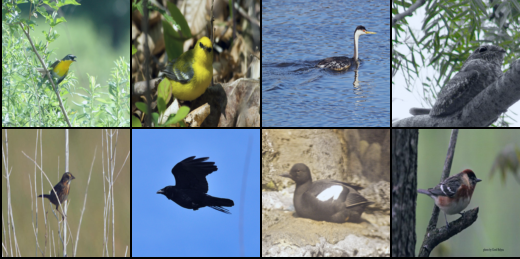
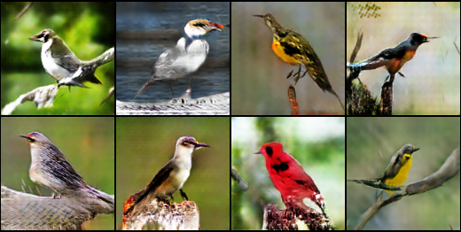

# Bird GAN

## Dataset
Using [Caltech-UCSD Birds-200-2011](http://www.vision.caltech.edu/visipedia-data/CUB-200-2011/CUB_200_2011.tgz)

*Training data sample*

## Requierments
- Pytorch
- Visdom
- Numpy

## Training
Run `python3 src/train.py`  
Optional arguments
- generator_model
- discriminator_model
- epochs

## Create image
Run `pythin3 src/image_generator.py model "model path"`  
Optional arguments
- image_path

## Results

*Generated sample after 1 epoch.*

*Generated sample after 50 epochs.*

*Generated sample after 200 epochs.*

*Generated sample after 500 epochs*