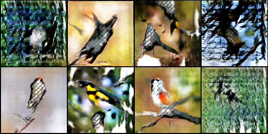

# Bird GAN

## Dataset
Using [Caltech-UCSD Birds-200-2011](http://www.vision.caltech.edu/visipedia/CUB-200-2011.html)

  
*Training data sample*

## Requirements
- Pytorch
- Visdom
- Numpy

## Training
Run `python3 -m visdom.server` to get training progress dashbord on [http://localhost:8097/](http://localhost:8097/)

Run `python3 src/train.py`
#### Arguments:
- `generator_model`: Path to generator model to continue training. default=`None`
- `discriminator_model`: Path to discriminator model to continue training. default=`None`
- `epochs`: Epoch to train the networks. default=`25`

## Create images
Run `python3 src/image_generator.py model "model path"`  
#### Arguments
- `image_path`: Path to save the generated images. default=`"./generated_images/generated_img.png"`
- `image_count`: How many images that will ne generated. default=`1`

## Results
  
*Generated sample after 1 epoch.*

  
*Generated sample after 50 epochs.*

  
*Generated sample after 200 epochs.*

  
*Generated sample after 500 epochs*